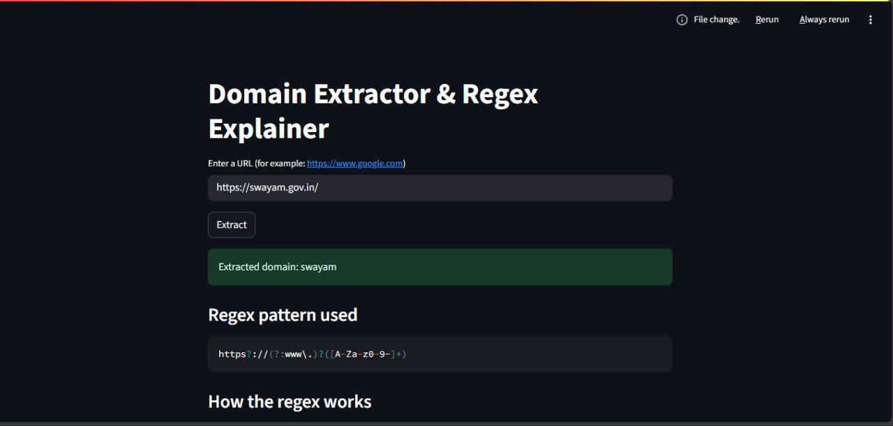
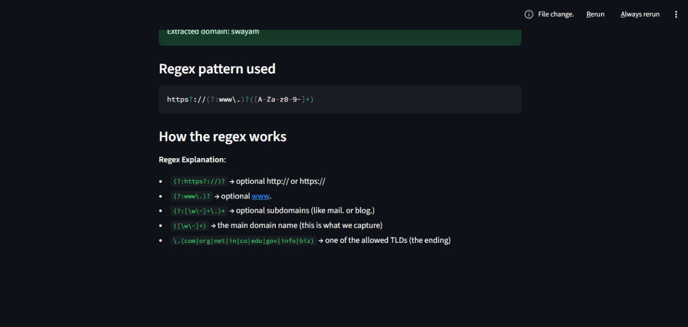

---

# 📌 Macro Project — Regular Expression Based Keyword Extraction

**College Project for NLP Subject**

This project demonstrates the use of **Python Regular Expressions (Regex)** to extract the **main keyword (domain name)** from a given URL.
For example:

* Input: `www.google.com` → Output: `google`
* Input: `https://www.openai.com` → Output: `openai`

In addition to extraction, the project also explains **how** the extraction was performed, making it educational as well as functional.

---

## 📂 Project Structure

```text
.
├── app.py              # Main application entry point
├── regex_logic.py      # Core keyword extraction logic
├── regex_explainer.py  # Explains the regex pattern
├── requirements.txt    # Project dependencies
└── README.md           # Documentation
```

---

## 🎯 Features

* Extracts the **keyword** (domain) from any URL
* Handles `http://`, `https://`, and `www.` prefixes
* Explains the regex pattern used for extraction
* Simple, lightweight, and educational

---

## ⚙️ Installation

Clone the repository:

```bash
git clone https://github.com/your-username/macro-project-regex.git
cd macro-project-regex
```

Install dependencies:

```bash
pip install -r requirements.txt
```

---

## 🚀 Usage

Run the app:

```bash
python -m streamlit run app.py
```

Or use the extraction logic in your own code:

```python
from regex_logic import extract_domain_name

url = "https://www.example.com"
keyword, pattern = extract_domain_name(url)

print("Keyword:", keyword)      # Output: example
print("Pattern used:", pattern)
```

---

## 🧠 Example Output

**Input:**

```
https://www.google.com
```

**Output:**

```
Keyword: google
Pattern used: https?://(?:www\.)?([A-Za-z0-9-]+)
Explanation: 
- `https?://` → matches http or https
- `(?:www\.)?` → optionally matches www.
- `([A-Za-z0-9-]+)` → captures the domain name (keyword)
```

---

## 📸 Project Screenshots

**Screenshot 1 — Main App Interface**


**Screenshot 2 — Regex Explanation Output**


---

